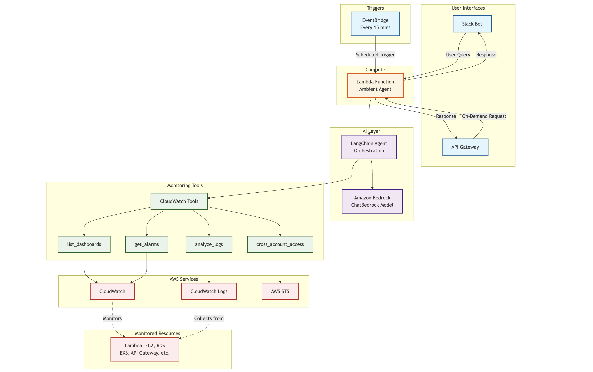

# AgentWatch - An Ambient AWS Resource Monitoring Agent

When using ChatGPT, Claude Code or any other chatbot type of interface, they rely on end users to invoke the chatbot to then accomplish a task. For example, if a user wants to perform deep research on "best ways of evaluating AI agents", they will have to type out their prompt on the user interface, and then engage in a multi-turn conversation with the chatbot until the chatbot (which is an agent under the hood usually), has all the context to kick off the job. Once the agent underlying the chatbot has all the required information, it either synchronously or asynchronously calls tools, refers to memory and engages with other external sources to perform the task (in this case, deep research). This has two disadvantages:

1. **User management**: In this case, the user is responsible to craft a prompt and supply that prompt to an agent. This requires the user to do most of the work and there is usually some prerequisites a user would have to follow to get the agent to start in the first place. For use cases that are more event driven in nature that are dynamic and not under the control of the user, this problem compounds because the AI agent would have to dynamically work with the changing environment but under the guidance and control of the user, which may fall out of rhythm.

2. **Lack of parallel processing**: In today's Agentic world, organizations don't want agents to accomplish one but several tasks in parallel. If a user provides a task upfront, then this makes it hard for us humans to scale ourselves. An agent can be only doing one task for us at a time.

If we think about the UI/UX experience, there should be two characteristics that should help us mitigate the pain points above:

1. **Triggered dynamically, in an event driven way**: It should not be triggered necessarily only by a human and should be more event driven. There should be some tracking mechanism that spins off an agent and the agent can complete or resume a task based on continuously provided memory and context.

2. **Parallel processing**: It should allow for multiple agents running in parallel to accomplish a task, with a human in the loop capability.



**Medium blog**: https://medium.com/@madhur.prashant7/agentwatch-an-ambient-aws-resource-monitoring-agent-d559e2e90051

The characteristics above are what defines an **ambient agent** (as referred by LangChain [here](https://blog.langchain.com/introducing-ambient-agents/#:~:text=Ambient%20agents%20listen%20to%20an%20event%20stream%20and%20act%20on%20it%20accordingly%2C%20potentially%20acting%20on%20multiple%20events%20at%20a%20time)):

```
Ambient agents listen to an event stream and act on it accordingly, potentially acting on multiple events at a time.
```

Ambient agents are also not the solution to everything. Thinking about bringing them involves a thoughtful consideration of when and how these agents can interact with humans and the control that the humans would have over the workflow of these agents as they execute and notify the end-user.

### AgentWatch

AgentWatch is a sample implementation of an ambient agent that is a hybrid ambient agent. There are some tasks that it performs that are fully autonomous (that are low on risk, for example referring to the AWS accounts and doing monitoring of resource utilization and providing the user with some information) and then there are some user actions that the user can configure and provide to the agent - for example analyzing the causes of alarms in the AWS account and fixing for it.

Several organizations use different platforms for communication. I recently attended an Anthropic event where someone mentioned: "AI is going to catch up to pace faster than we think it is", which means that organizations are going to be structured differently and you are going to be working with autonomous workers (or agents) over Slack that will be able to accomplish tasks faster, more efficiently and have a much tighter loop with the end users. For the purpose of this solution, we use **Slack** as the end user interface where the ambient agent will be posting messages to and from where end users will then interact with the agent on demand as well.

## Human in the Loop in Ambient Agents

Human-in-the-loop (HITL) is a fundamental component for building trustworthy ambient agents. While ambient agents operate autonomously and respond to event streams, they must know when to involve humans in their decision-making process. AgentWatch implements three core HITL patterns that balance autonomy with appropriate human oversight.

### The Three HITL Patterns

**1. Notify Pattern**

The notify pattern alerts users about important events without taking any action. This is useful for flagging events that users should be aware of but where the agent is not empowered to act on them. In AgentWatch, this pattern is implemented through scheduled monitoring reports. Every 15 minutes, the agent generates a comprehensive monitoring report covering CloudWatch alarms, critical issues, and resource health across AWS services. The agent posts these reports to a Slack channel, keeping the team informed without requiring immediate action or approval. This allows users to maintain situational awareness while the agent handles the routine work of aggregating and summarizing monitoring data.

**2. Question Pattern**

The question pattern enables the agent to ask users for clarification when it encounters uncertainty about how to proceed. This prevents the agent from making incorrect assumptions or taking inappropriate actions when faced with ambiguous situations. For example, if AgentWatch detects a critical alarm but is unclear whether to proceed with automated remediation or escalate to an on-call engineer, it can post a question to Slack asking for guidance. Similarly, when attempting to modify AWS resources or perform sensitive operations, the agent can ask for clarification on the specific approach to take, similar to how an SRE would consult with a senior administrator before making significant changes to production systems.

**3. Review Pattern**

The review pattern allows users to approve, reject, or edit actions before the agent executes them. This is particularly important for sensitive operations where human judgment is required. In AgentWatch, this pattern can be applied when the agent wants to perform potentially impactful actions such as modifying AWS resources, adjusting scaling policies, or changing alarm thresholds. The agent presents its proposed action to the user via Slack, along with relevant context and reasoning. The user can then approve the action to proceed, reject it entirely, or edit the parameters before execution. This ensures that critical decisions remain under human control while still benefiting from the agent's ability to identify issues and propose solutions.

These HITL patterns lower implementation risks by ensuring appropriate human oversight, mimic natural human communication patterns found in engineering teams, and enable the agent to learn from user feedback over time to better align with organizational preferences and policies.

## How AgentWatch Works

AgentWatch is built as a LangChain agent with access to seven specialized monitoring tools for AWS infrastructure. The agent uses Amazon Bedrock's Claude model for natural language understanding and can analyze CloudWatch dashboards, fetch logs, examine alarms, and perform cross-account monitoring. The architecture follows a hybrid ambient model with both scheduled monitoring and on-demand interaction capabilities.

The agent is deployed on AgentCore Runtime, which provides a secure, serverless, and purpose-built hosting environment for running AI agents at scale regardless of the agent framework or model provider. Once deployed, the agent is available as an HTTP endpoint that can be invoked programmatically. Authentication is handled through AgentCore Identity using OAuth 2.0 with Cognito as the identity provider, though any OIDC-compliant IdP can be used.

The deployment infrastructure consists of three main components working together. First, an AWS Lambda function serves as the orchestration layer, responsible for authenticating with Cognito to obtain bearer tokens, invoking the AgentCore Runtime endpoint with appropriate prompts, and formatting responses for Slack. Second, Amazon EventBridge provides scheduled invocation capability through a rule configured to trigger every 15 minutes. When triggered, the Lambda function uses a pre-configured monitoring prompt that asks the agent to provide summaries of CloudWatch alarms, critical issues, and resource health. Third, an API Gateway exposes the Lambda function as an HTTP endpoint that integrates with a Slack app through slash commands. When users type a question in Slack using the configured slash command, the request routes to API Gateway, which invokes the Lambda function with the user's question as the prompt.

This dual-trigger architecture enables AgentWatch to operate in two modes. In scheduled mode, the agent runs autonomously every 15 minutes, proactively monitoring AWS infrastructure and posting reports to keep teams informed without manual intervention. In on-demand mode, users can ask specific questions through Slack and receive immediate responses, allowing for interactive troubleshooting and investigation when needed. Both modes leverage the same underlying agent and tools, providing consistent monitoring capabilities whether operating autonomously or responding to user queries.

## AgentWatch in Action

The following screenshots demonstrate both operational modes of AgentWatch.

### Scheduled Monitoring Reports


Every 15 minutes, AgentWatch automatically generates and posts comprehensive monitoring reports to Slack, providing the team with continuous visibility into AWS infrastructure health.

### On-Demand Interaction


Users can ask specific questions through Slack slash commands to investigate issues or get real-time information.


The agent processes the question and provides detailed, context-aware responses based on current AWS infrastructure state.

## Getting Started

This section walks you through deploying AgentWatch from initial setup to production deployment.

### Prerequisites

Before deploying AgentWatch, ensure you have the following:

- **AWS Account** with appropriate permissions to create Lambda functions, IAM roles, EventBridge rules, and API Gateway resources
- **AWS CLI** installed and configured with credentials
- **Python 3.10+** for local development and AgentCore CLI
- **Slack Workspace** with permissions to create and configure apps
- **Cognito User Pool** (for manual deployment only) - configured with OAuth 2.0 client credentials (M2M authentication recommended) or username/password authentication. *Note: CloudFormation deployment creates this automatically.*

### Deployment Options

AgentWatch offers two deployment paths:

| Option | Best For | What It Does |
|--------|----------|--------------|
| **CloudFormation (Recommended)** | Quick setup, production deployments | One-click deployment of all AWS resources |
| **Manual Deployment** | Learning, customization | Step-by-step setup with full control |

---

## Option A: CloudFormation Deployment (Recommended)

The CloudFormation deployment creates all required AWS resources with a single command.

### A1. Create Slack App

1. Go to https://api.slack.com/apps and click **Create New App**
2. Choose **From scratch**, name it "AgentWatch", select your workspace
3. Enable **Incoming Webhooks** and add a webhook to your channel
4. Copy the **Webhook URL**
5. Go to **Basic Information** and copy the **Signing Secret**

### A2. Deploy CloudFormation Stack

```bash
cd deployment/cloudformation
./deploy-stack.sh
```

The script will prompt for:
- Slack Webhook URL
- Slack Signing Secret
- Cognito Domain Prefix (unique identifier)

### A3. Deploy AgentCore Runtime

```bash
# From project root
pip install bedrock-agentcore-starter-toolkit
agentcore configure -e ambient_agent.py
agentcore launch --agent AgentWatch
```

### A4. Update Stack with AgentCore URL

After AgentCore deployment, update the stack with the runtime URL:

```bash
aws cloudformation update-stack \
  --stack-name agentwatch \
  --use-previous-template \
  --parameters \
    ParameterKey=SlackWebhookUrl,UsePreviousValue=true \
    ParameterKey=SlackSigningSecret,UsePreviousValue=true \
    ParameterKey=CognitoDomainPrefix,UsePreviousValue=true \
    ParameterKey=AgentCoreRuntimeUrl,ParameterValue="YOUR_AGENTCORE_URL" \
  --capabilities CAPABILITY_NAMED_IAM
```

### A5. Configure Slack Slash Command

1. Go to your Slack app → **Slash Commands**
2. Create `/ask` command
3. Set Request URL to the `SlackCommandEndpoint` from stack outputs
4. Save changes

### A6. Add AgentCore Permissions

```bash
aws iam put-role-policy \
  --role-name <YOUR_AGENTCORE_ROLE> \
  --policy-name CloudWatchMonitoringAccess \
  --policy-document '{
    "Version": "2012-10-17",
    "Statement": [{
      "Effect": "Allow",
      "Action": [
        "cloudwatch:DescribeAlarms",
        "cloudwatch:ListDashboards",
        "cloudwatch:GetDashboard",
        "logs:DescribeLogGroups",
        "logs:FilterLogEvents",
        "logs:GetLogEvents"
      ],
      "Resource": "*"
    }]
  }'
```

For more details, see [deployment/cloudformation/README.md](deployment/cloudformation/README.md).

---

## Option B: Manual Deployment

For more control over the deployment process, follow these detailed steps.

### Step 1: Create and Configure Slack App

AgentWatch integrates with Slack to deliver monitoring reports and respond to user questions. You need to create a Slack app and configure it with the necessary permissions.

1. Go to https://api.slack.com/apps and click **Create New App**
2. Choose **From scratch** and provide an app name (e.g., "AgentWatch") and select your workspace
3. Navigate to **Incoming Webhooks** in the left sidebar
4. Toggle **Activate Incoming Webhooks** to On
5. Click **Add New Webhook to Workspace** and select the channel where monitoring reports should be posted
6. Copy the webhook URL (format: `https://hooks.slack.com/services/T.../B.../xxx`)
7. Navigate to **Slash Commands** in the left sidebar
8. Click **Create New Command** and configure:
   - Command: `/ask` (or your preferred command name)
   - Request URL: Leave this blank for now - you'll update it after deployment
   - Short Description: "Ask the AgentWatch monitoring agent a question"
   - Usage Hint: "What is the status of my CloudWatch alarms?"
9. Navigate to **Basic Information** in the left sidebar
10. Under **App Credentials**, copy the **Signing Secret** - you'll need this for request verification


### Step 2: Configure Identity Provider for Authentication

AgentWatch uses AgentCore Identity with OAuth 2.0 for secure authentication. You need to configure a Cognito User Pool with appropriate app clients.

For detailed instructions on setting up Cognito for AgentCore Identity, refer to the AgentCore documentation. You will need to configure either:

- **M2M Authentication (Recommended)**: OAuth 2.0 Client Credentials flow for service-to-service authentication
- **Username/Password Authentication (Fallback)**: USER_PASSWORD_AUTH flow with user credentials

Save the following values from your Cognito configuration:
- Cognito Domain URL
- M2M Client ID and Client Secret (for M2M auth)
- Resource Server ID (if using custom scopes)
- User Pool ID, Client ID, and user credentials (for username/password auth)

First, install the dependencies:

```bash
uv sync
```

Then run the Cognito setup script:

```bash
uv run python idp_setup/setup_cognito.py
```

The results will be stored in a `cognito_config.json` file. 

### Step 3: Test Agent Locally

Before deploying to AgentCore Runtime, test the agent locally to ensure it works correctly with your AWS environment.

1. Clone this repository and navigate to the project directory
2. Configure your AWS credentials and ensure you have access to CloudWatch, Lambda, and other services the agent will monitor
3. Run the agent locally:
   ```bash
   uv run python ambient_agent.py
   ```
4. Test the agent by sending sample prompts:

   Open another terminal in the same directory and start a Python interactive session:
   ```bash
   uv run python3
   ```

   Then test the agent with sample prompts:
   ```python
   >>> from ambient_agent import agent_handler
   >>> response = agent_handler({"prompt": "List my CloudWatch dashboards", "session_id": "test"})
   >>> print(response)
   ```

   Try different prompts to verify the agent can access your AWS resources:
   ```python
   >>> response = agent_handler({"prompt": "What is the status of my CloudWatch alarms?", "session_id": "test"})
   >>> print(response)
   ```

   Exit the Python session when done:
   ```python
   >>> exit()
   ```

5. Verify that the agent responds appropriately and can successfully query your AWS environment

### Step 4: Deploy Agent to AgentCore Runtime

Deploy the agent to AgentCore Runtime to make it available as a secure HTTP endpoint.

1. Install the AgentCore CLI in the uv environment:
   ```bash
   uv add bedrock-agentcore-starter-toolkit
   ```

2. Update the `config.yaml` file with your model preferences and tool configurations

3. Configure the agent:
   ```bash
   uv run agentcore configure -e ambient_agent.py
   ```
   When prompted during configuration, provide the following values:

   **Basic Configuration:**
   - **Agent Name**: `AgentWatch` (or your preferred name)
   - **Deployment Type**: Choose `direct_code_deploy`
   - **Execution Role ARN**: Your AWS IAM role ARN for AgentCore Runtime

   **OAuth Configuration** (use values from your `cognito_config.json` file):
   - **OAuth discovery URL**: Use the `discovery_url` value from your cognito_config.json
     ```
     https://cognito-idp.us-east-1.amazonaws.com/us-east-1_XXXXXXXXX/.well-known/openid-configuration
     ```
   - **Allowed OAuth client IDs**: Use the `client_id` value from your cognito_config.json
     ```
     your_client_id_here
     ```
   - **Allowed OAuth audience**: Use the `resource_server_id` value from your cognito_config.json
     ```
     your_resource_server_id_here
     ```

   After configuration completes, verify the `.bedrock_agentcore.yaml` file was created with your settings.

4. Launch the agent on AgentCore Runtime:
   ```bash
   uv run agentcore launch
   ```

5. Get the AgentCore Runtime URL for Lambda configuration:

   After deployment, you need to get the correct runtime URL. Use the provided script:
   ```bash
   uv run python get_agent_url.py
   ```

   When prompted, enter your Bedrock AgentCore ARN from the `.bedrock_agentcore.yaml` file:
   ```
   Enter your Bedrock AgentCore ARN: arn:aws:bedrock-agentcore:us-east-1:ACCOUNT_ID:runtime/AgentWatch-XXXXX
   ```

   The script will output the invocation URL that you'll need for the Lambda configuration:
   ```
   Invocation URL:
   https://bedrock-agentcore.us-east-1.amazonaws.com/runtimes/arn%3Aaws%3A...../invocations?qualifier=DEFAULT
   ```

   Copy this URL - you'll use it as `AGENTCORE_RUNTIME_URL` in your `.env` file.

### Step 5: Configure Environment Variables

Create a `.env` file with all the configuration values you've collected:

1. Copy the example environment file:
   ```bash
   cp .env.example .env
   ```
2. Edit the `.env` file with your actual values:
   ```bash
   # AWS Configuration
   AWS_REGION=us-west-2

   # AgentCore Runtime URL (from Step 4)
   AGENTCORE_RUNTIME_URL=https://bedrock-agentcore...

   # Cognito Configuration - M2M (Recommended)
   COGNITO_DOMAIN_URL=https://your-domain.auth.us-west-2.amazoncognito.com
   M2M_CLIENT_ID=your_m2m_client_id
   M2M_CLIENT_SECRET=your_m2m_client_secret
   RESOURCE_SERVER_ID=your_resource_server_id

   # Slack Configuration (from Step 1)
   SLACK_WEBHOOK_URL=https://hooks.slack.com/services/T.../B.../xxx
   SLACK_SIGNING_SECRET=your_slack_signing_secret
   ```

All values specified in `.env.example` should be configured. The deployment script will validate that required variables are present.

### Step 6: Deploy Lambda Function and Infrastructure

Run the deployment script to create the Lambda function, EventBridge rule, and API Gateway:

```bash
cd deployment
chmod +x deploy.sh
./deploy.sh
```

The script will:
1. Create an IAM role for Lambda with necessary permissions
2. Package and deploy the Lambda function code
3. Configure environment variables from your `.env` file
4. Create an EventBridge rule to trigger the agent every 15 minutes
5. Create an API Gateway endpoint for Slack slash commands
6. Set up all necessary permissions and integrations

At the end of deployment, the script will output an API Gateway URL. Copy this URL - you'll need it for the next step.

### Step 7: Update Slack App with API Gateway URL

Now that you have the API Gateway endpoint, update your Slack app configuration:

1. Go back to https://api.slack.com/apps and select your app
2. Navigate to **Slash Commands**
3. Click on the `/ask` command (or whatever you named it)
4. Update the **Request URL** with the API Gateway URL from Step 6
5. Click **Save**

### Step 8: Test the Deployment

**Test On-Demand Questions:**
Go to your Slack workspace and try the slash command:

```
/ask What is the status of my CloudWatch alarms?
```

The agent should respond with current information from your AWS environment.

---

## Redeploying After Code Changes

When you make changes to the agent code, redeploy to AgentCore:

```bash
# Using the provided script
./deployment/redeploy_agentcore.sh --wait

# Or directly with agentcore CLI
agentcore launch --agent AgentWatch
```

The DEFAULT endpoint automatically points to the latest version.

---

## Troubleshooting

### Architecture Mismatch on Apple Silicon Macs (ARM64)

If you encounter an error like this when running the agent:

```
ImportError: dlopen(.../_pydantic_core.cpython-312-darwin.so, 0x0002): tried: '...'
(mach-o file, but is an incompatible architecture (have 'x86_64', need 'arm64'))
```

This means your terminal is running under Rosetta (x86_64 emulation) instead of native ARM64 mode. This causes Python packages to be installed for the wrong architecture.

**To verify the issue**, run:
```bash
arch
```

If it shows `i386` or `x86_64` instead of `arm64`, your terminal is running in emulation mode.

**Fix for PyCharm's built-in terminal:**

1. Go to **Settings/Preferences > Tools > Terminal**
2. Change the **Shell path** from `/bin/zsh` to:
   ```
   /usr/bin/arch -arm64 /bin/zsh
   ```
3. Close and reopen the terminal tab
4. Verify with `arch` (should now show `arm64`)

**Fix for macOS Terminal app:**

1. Open Finder and navigate to Applications > Utilities
2. Right-click on Terminal > **Get Info**
3. Uncheck **"Open using Rosetta"**
4. Restart Terminal

**After fixing the terminal**, recreate the virtual environment:
```bash
rm -rf .venv && uv venv && uv sync
```

## Conclusion

AgentWatch demonstrates how ambient agents can provide continuous, proactive monitoring of infrastructure while maintaining appropriate human oversight through well-designed HITL patterns. By combining scheduled autonomous operation with on-demand interaction capabilities, the system achieves a balance between automation and control that aligns with operational best practices.

The architecture leverages AWS managed services and AgentCore Runtime to provide a scalable, secure foundation for ambient agent deployment. The notify, question, and review patterns ensure that humans remain informed and in control while reducing the operational burden of routine monitoring tasks. This approach can be extended to other domains beyond AWS monitoring, applying the same principles to any scenario where continuous observation and selective human involvement are required.

Organizations implementing ambient agents should carefully consider which tasks are appropriate for full autonomy versus those requiring human approval, design clear communication channels between agents and humans, and establish feedback mechanisms that allow agents to learn from human decisions over time. AgentWatch serves as a practical reference implementation for these concepts.
